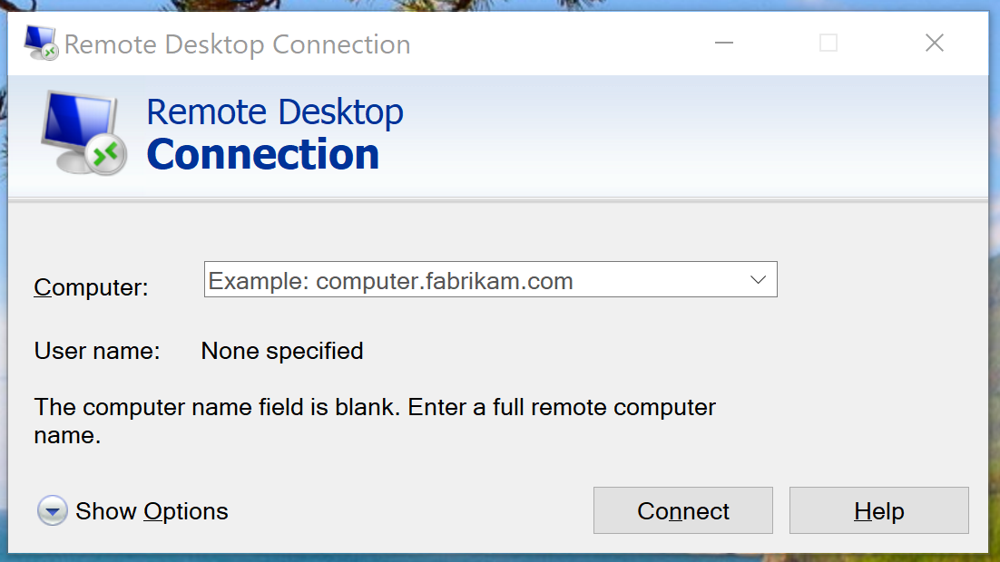
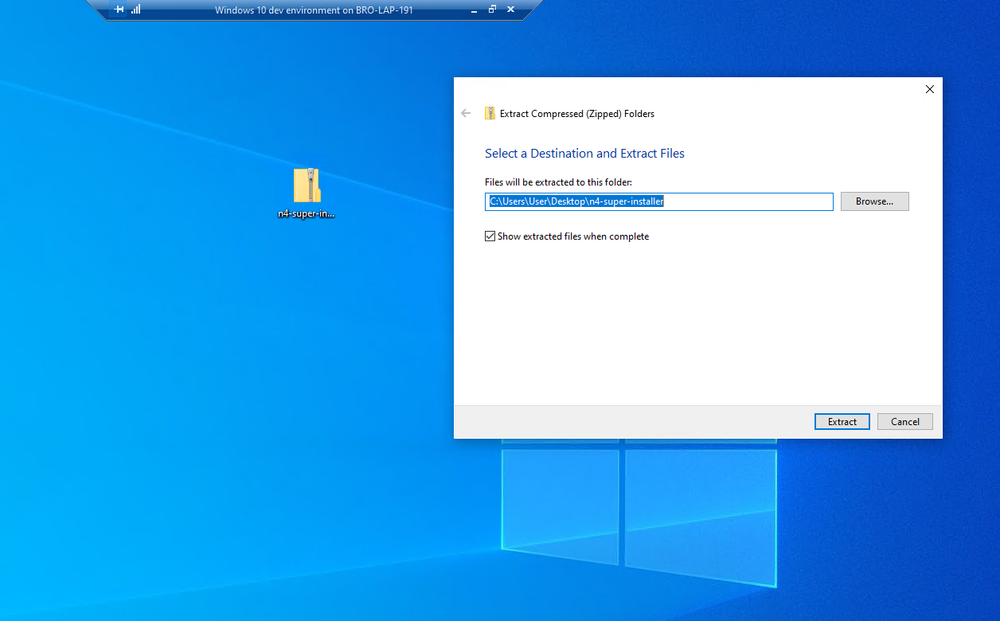

<!-- Bootstrap CSS -->
<link rel="stylesheet" href="https://cdn.jsdelivr.net/npm/bootstrap@4.5.3/dist/css/bootstrap.min.css" integrity="sha384-TX8t27EcRE3e/ihU7zmQxVncDAy5uIKz4rEkgIXeMed4M0jlfIDPvg6uqKI2xXr2" crossorigin="anonymous">
<link rel="stylesheet" href="assets/readme/readme.css">

# n4-super-installer

This powershell script automates portions of the installation process for an N4 Supervisor.

## Directions of use

1. Open a Remote Desktop Connection with the server<br>
<br><br>

2. Copy and paste the *n4-super-installer* zip file from your computer to the server.


3. Unzip the installer on your Windows user's desktop.


4. Open the Windows Start Menu and type *powershell*, then select Run As Administrator
<br><br>

5. On the command prompt, type:

```powershell
$env:homedrive, $env:homepath, "\Desktop\n4-super-installer" -join "";
Set-ExecutionPolicy Bypass -Scope Process -Force; .\scripts\installer.ps1
```

7. Press **Enter** and wait to follow the prompts for the software installation setups, which will be installed in sequential order. At this point the installer has created the *D:\Controls Software* folder and copied all the contents from the current download folder to where applications should be in.

8. After all the setups are done the installer will copy the jars into the modules directory, it will copy the license file into its proper folder, and copy the start menu shortcut folders from the installation user directory to the allusersprofile start menu shortcut directory.

9. TODO - Still need to figure out at which point during the EC-Net installation process the nre.properties file is added to the %APPDATA% niagara etc folder.


<br><br>

## Engineering Notes

> In eventvwr.msc, we are looking for the process-creation (4688) and process-terminations (4689) events in the Windows event viewer to track the overall install process

<br>The expected output in the event viewer for each setup.exe program this installer runs should look like this:
| Keywords      | Date and Time         | Source                               | Event ID | Task Category    |
| ------------- | --------------------- | ------------------------------------ | -------- | ---------------- |
| Audit Success	| 12/1/2020 12:44:21 PM | Microsoft Windows security auditing. | 4688     |	Process Creation |
| Audit Success	| 12/1/2020 12:44:21 PM | Microsoft Windows security auditing. | 4688     | Process Creation |
<br>
followed by:<br>

| Keywords      | Date and Time         | Source                               | Event ID | Task Category       |
| ------------- | --------------------- | ------------------------------------ | -------- | ------------------- |
| Audit Success	| 12/1/2020 12:48:37 PM | Microsoft Windows security auditing. | 4688     |	Process Termination |
| Audit Success	| 12/1/2020 12:49:12 PM | Microsoft Windows security auditing. | 4688     | Process Termination |

**full event log details**
```
Log Name:      Security
Source:        Microsoft-Windows-Security-Auditing
Date:          12/1/2020 12:44:21 PM
Event ID:      4688
Task Category: Process Creation
Level:         Information
Keywords:      Audit Success
User:          N/A
Computer:      WinDev2010Eval
Description:
A new process has been created.

Creator Subject:
	Security ID:		S-1-5-21-3858184157-4174427647-2357676267-1001
	Account Name:		User
	Account Domain:		WINDEV2010EVAL
	Logon ID:		0x31F70

Target Subject:
	Security ID:		S-1-0-0
	Account Name:		-
	Account Domain:		-
	Logon ID:		0x0

Process Information:
	New Process ID:		0x249c
	New Process Name:	C:\Users\User\AppData\Local\Temp\is-NVBLR.tmp\Distech Controls EC-gfxProgram v6.6.20212 Setup.tmp
	Token Elevation Type:	%%1937
	Mandatory Label:		S-1-16-12288
	Creator Process ID:	0x26c0
	Creator Process Name:	C:\Users\User\projects\n4-super-installer\assets\installers\Distech Controls EC-gfxProgram v6.6.20212 Setup.exe
```
<br>

```
Log Name:      Security
Source:        Microsoft-Windows-Security-Auditing
Date:          12/1/2020 12:44:21 PM
Event ID:      4688
Task Category: Process Creation
Level:         Information
Keywords:      Audit Success
User:          N/A
Computer:      WinDev2010Eval
Description:
A new process has been created.

Creator Subject:
	Security ID:		S-1-5-21-3858184157-4174427647-2357676267-1001
	Account Name:		User
	Account Domain:		WINDEV2010EVAL
	Logon ID:		0x31F70

Target Subject:
	Security ID:		S-1-0-0
	Account Name:		-
	Account Domain:		-
	Logon ID:		0x0

Process Information:
	New Process ID:		0x26c0
	New Process Name:	C:\Users\User\projects\n4-super-installer\assets\installers\Distech Controls EC-gfxProgram v6.6.20212 Setup.exe
	Token Elevation Type:	%%1937
	Mandatory Label:		S-1-16-12288
	Creator Process ID:	0x6fc
	Creator Process Name:	C:\Windows\System32\WindowsPowerShell\v1.0\powershell.exe
```

> Command References   
  secpol.msc<br>
  eventvwr.msc <br>

  ```powershell
  clear-eventlog -logname Security -computername ($env:COMPUTERNAME)
  ```